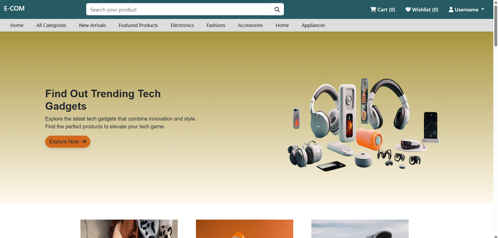
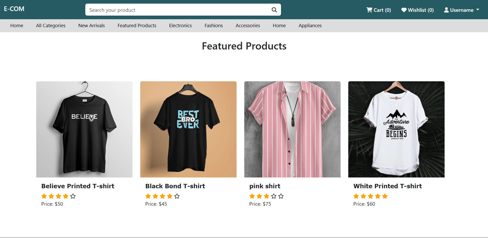
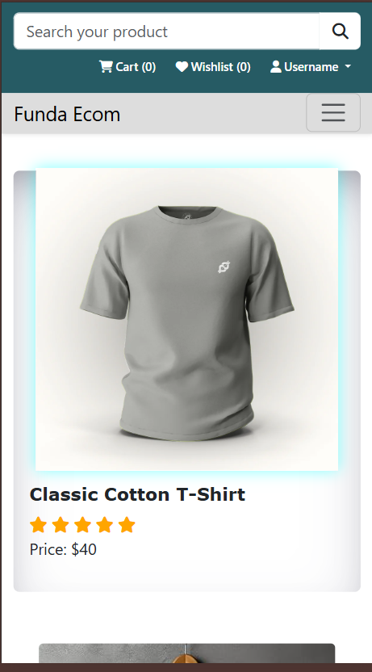
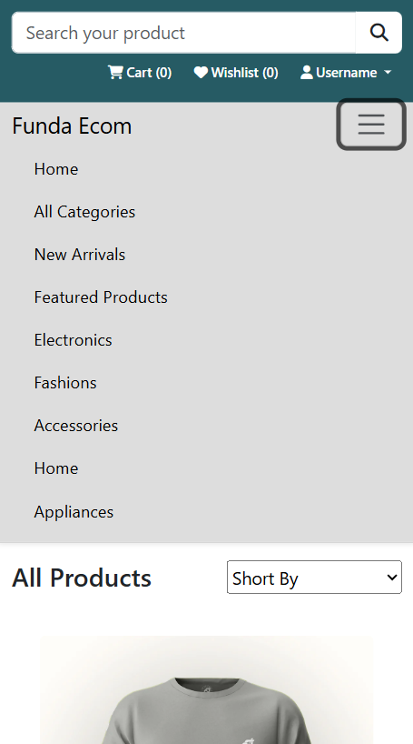

<h1 align="center" id="title">E-Commerce</h1>

<p id="description">A modern and stylish e-commerce website UI built using HTML CSS Bootstrap and EJS templates. This project showcases a responsive and interactive shopping experience with features like hover effects featured products and a visually appealing layout.</p>

<h2>Project Screenshots:</h2>









  
  
<h2>🧐 Features</h2>

Here're some of the project's best features:

*   Fully Responsive – Works perfectly on mobile tablet and desktop.
*   Dynamic Product Display – Showcases trending and featured products.
*   Clean & Modern UI – Built with a sleek design for a smooth user experience.
*   Hover Effects on Images – Product images change smoothly when hovered.
*   Wishlist Icon Overlay – Adds an interactive feel with heart icons on products.
*   Bootstrap 5 Integration – Utilizes Bootstrap for a professional and responsive layout.

<h2>🛠️ Installation Steps:</h2>

<p>1. Clone the repository:</p>

```
git clone https://github.com/yourusername/ecommerce.git
```

<p>2. Go working directory</p>

```
cd ecommerce-frontend
```

<p>3. Run</p>

```
node index.js
```

  
  
<h2>💻 Built with</h2>

Technologies used in the project:

*   HTML CSS – For structure and styling
*   Bootstrap – For a responsive and elegant UI
*   EJS (Embedded JavaScript) – For templating and reusable components
*   JavaScript – For interactive elements
